# REQUERIMIENTOS TÉCNICOS - AMBIENTE PREPRODUCCIÓN
## Despliegue Ecosistema Dockerizado KitchnTabs & Vanexa

**Solicitante:** Departamento TI  
**Fecha:** Agosto 2026  
**Ambiente:** Preproducción (Staging)  
**Proyectos:** KitchnTabs y Vanexa  
**Versión:** 1.0

---

## 📋 Tabla de Contenidos

- [Resumen Ejecutivo](#resumen-ejecutivo)
- [Arquitectura del Sistema](#arquitectura-del-sistema)
- [Especificaciones de Hardware](#especificaciones-de-hardware)
- [Configuración de Puertos](#configuración-de-puertos)
- [Servicios Docker](#servicios-docker)
- [Automatización y Monitoreo](#automatización-y-monitoreo)
- [Seguridad](#seguridad)
- [Plan de Migración](#plan-de-migración)
- [Formulario de Solicitud](#formulario-de-solicitud)

---

## Resumen Ejecutivo

Se requiere asignación de una **Máquina Virtual dedicada** para alojar el ecosistema de aplicaciones dockerizado con dos proyectos principales (KitchnTabs y Vanexa) en ambiente de preproducción.

### Cambio de Infraestructura

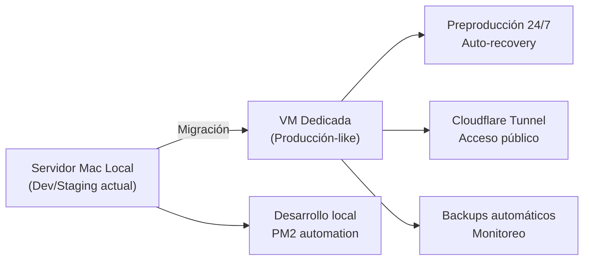

**El Sistema Requiere:**
- ✅ Máquina Virtual dedicada con 8 vCPU, 32 GB RAM, 500 GB SSD
- ✅ Docker Engine v24.x + Docker Compose v2.x
- ✅ PostgreSQL (2 instancias), Redis (2 instancias)
- ✅ Túnel Cloudflare para acceso público
- ✅ PM2 para automatización y recuperación
- ✅ Backups automáticos y monitoreo 24/7

---

## Arquitectura del Sistema

### Diagrama de Arquitectura General

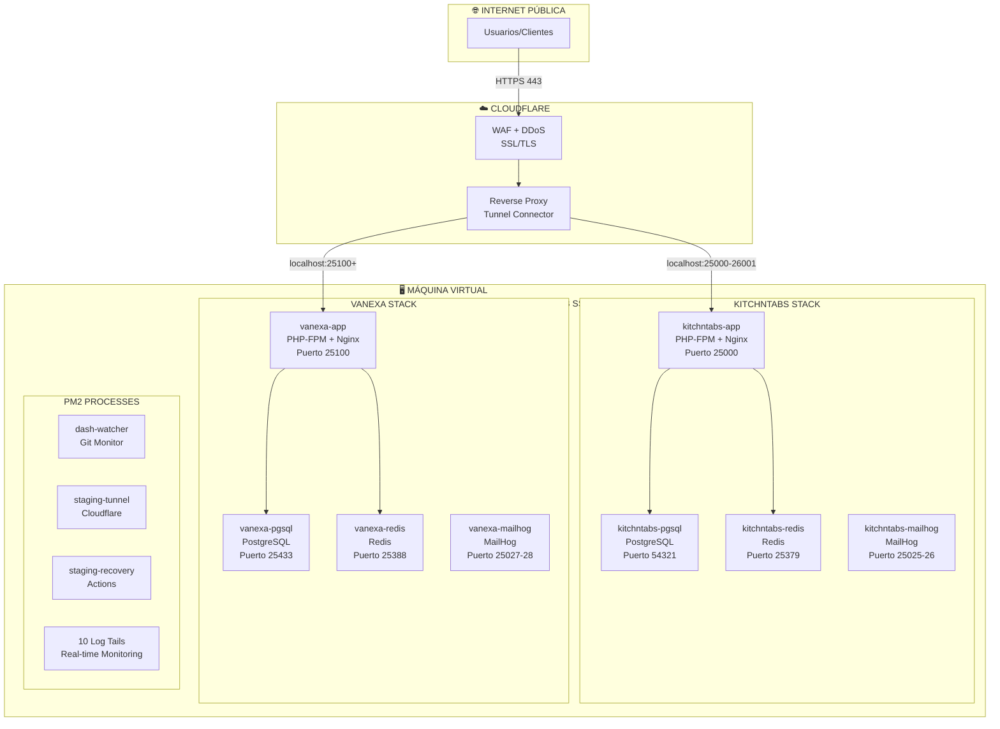

### Flujo de Solicitud HTTP

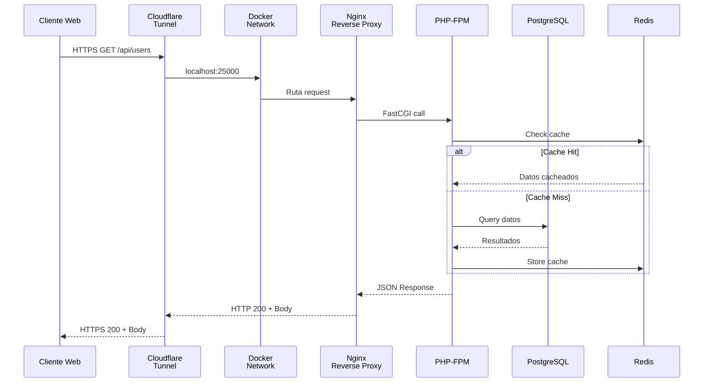

### Flujo WebSocket (Reverb)

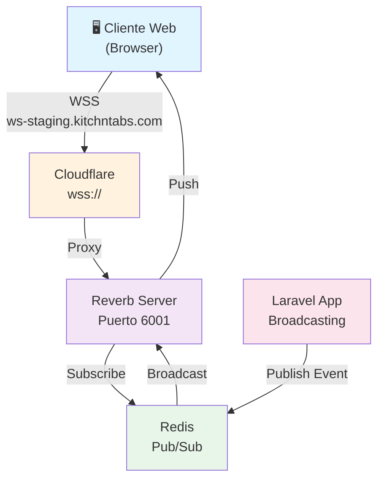

---

## Especificaciones de Hardware

### Recursos de Máquina Virtual

| Parámetro | Requerimiento | Justificación |
|---|---|---|
| **vCPU** | 8 (mínimo) | 4 apps Node.js + Docker daemon + servicios |
| **RAM** | 32 GB | Docker VM + 4 contenedores + BD + caché |
| **Storage** | 500 GB SSD | BD (100GB c/u), logs, assets, backups |
| **Tipo Storage** | NVMe RAID 1 | Performance + redundancia |
| **Red** | Gigabit (1 Gbps) | Comunicación intra-contenedores + tráfico externo |

### Distribución de Recursos

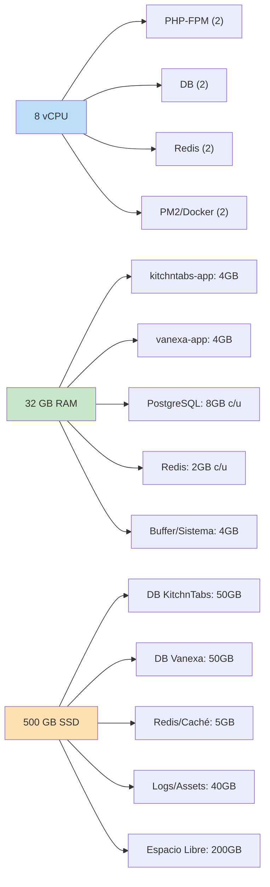

---

## Configuración de Puertos

### Puertos Internos (Docker)

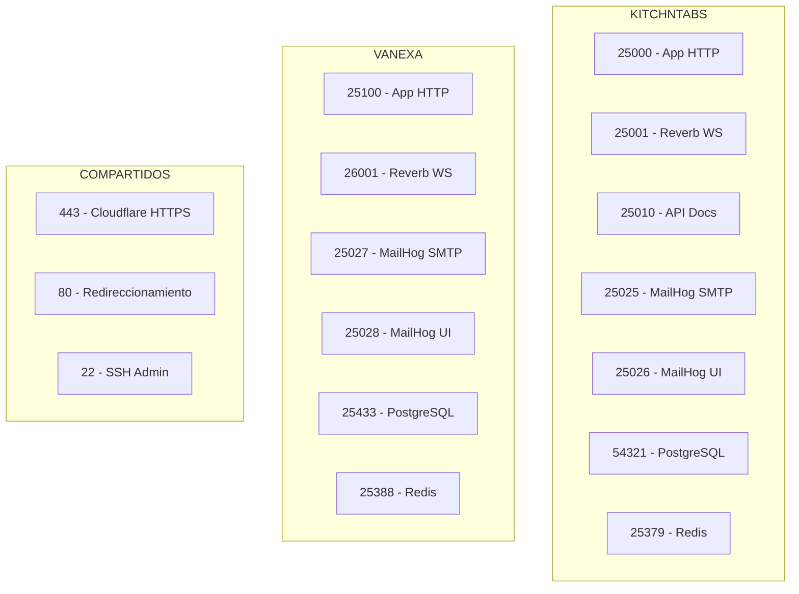

### Reglas de Firewall Requeridas

| Dirección | Puerto | Protocolo | Origen/Destino | Persistencia |
|---|---|---|---|---|
| **ENTRADA** |  |  |  |  |
|  | 443 (HTTPS) | TCP | Internet (0.0.0.0/0) | Permanente |
|  | 80 (HTTP) | TCP | Internet (0.0.0.0/0) | Permanente |
|  | 22 (SSH) | TCP | IPs autorizadas | Permanente |
| **SALIDA** |  |  |  |  |
|  | 443 (HTTPS) | TCP | Internet (0.0.0.0/0) | Permanente |
|  | 53 (DNS) | UDP/TCP | 8.8.8.8, 1.1.1.1 | Permanente |
|  | * (Todas) | TCP | Repos, npm, Composer | Permanente |

---

## Servicios Docker

### Stack de Contenedores

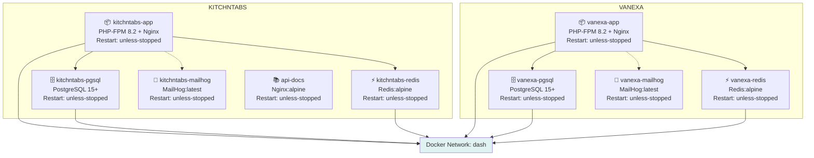

### Servicios dentro de kitchntabs-app

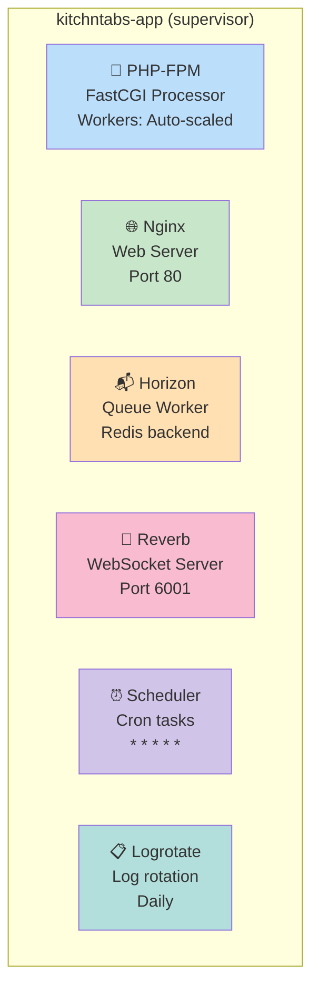

---

## Almacenamiento y Volúmenes

### Estructura de Almacenamiento

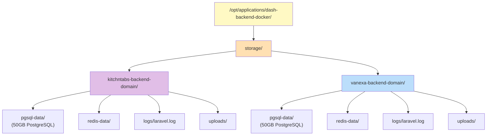

### Volúmenes Docker

| Tipo | Nombre | Montaje | Tamaño | Persistencia |
|---|---|---|---|---|
| **Named Volume** | `dash-redis` | `/data` | 2 GB | Entre reboots |
| **Named Volume** | `dash-composer-cache` | `/.composer` | 1 GB | Entre reboots |
| **Bind Mount** | `./storage/kitchntabs/` | `/var/www/dash/storage` | 50 GB | Permanente (host) |
| **Bind Mount** | `./storage/vanexa/` | `/var/www/dash/storage` | 50 GB | Permanente (host) |

---

## Automatización y Monitoreo

### Procesos PM2

```mermaid
graph TB
    PM2["PM2 Process Manager<br/>(Supervisor)"]
    
    WATCH["dash-watcher<br/>Git Monitor<br/>Polls: 60s"]
    TUNNEL["staging-tunnel<br/>Cloudflare Connector<br/>Status: Online"]
    RECOVERY["staging-recovery<br/>Emergency Actions<br/>Idle + Listening"]
    
    KL["kitchntabs-laravel-log<br/>App logs"]
    KH["kitchntabs-horizon-log<br/>Queue logs"]
    KR["kitchntabs-reverb-log<br/>WebSocket logs"]
    KA["kitchntabs-ai-agents-log<br/>AI tracking"]
    KC["kitchntabs-container-log<br/>Docker stdout"]
    
    VL["vanexa-laravel-log<br/>App logs"]
    VH["vanexa-horizon-log<br/>Queue logs"]
    VR["vanexa-reverb-log<br/>WebSocket logs"]
    VA["vanexa-ai-agents-log<br/>AI tracking"]
    VC["vanexa-container-log<br/>Docker stdout"]
    
    PM2 --> WATCH
    PM2 --> TUNNEL
    PM2 --> RECOVERY
    PM2 --> KL
    PM2 --> KH
    PM2 --> KR
    PM2 --> KA
    PM2 --> KC
    PM2 --> VL
    PM2 --> VH
    PM2 --> VR
    PM2 --> VA
    PM2 --> VC
    
    style PM2 fill:#fff9c4
    style WATCH fill:#e1bee7
    style TUNNEL fill:#c8e6c9
    style RECOVERY fill:#ffccbc
    style KL fill:#bbdefb
    style VL fill:#b2dfdb
```

### Dashboard PM2 Monit

```
┌────────────────────────────────────────────────────────────┐
│ PM2 MONIT - Real-time Monitoring                           │
├────────────────────────────────────────────────────────────┤
│                                                             │
│ Name                    Mode  Status  CPU   Memory          │
│ ─────────────────────────────────────────────────────────  │
│ dash-watcher            fork  online  0.2%  45 MB           │
│ staging-tunnel          fork  online  0.5%  120 MB          │
│ staging-recovery        fork  online  0.0%  30 MB           │
│ kitchntabs-laravel-log  fork  online  0.1%  15 MB           │
│ kitchntabs-horizon-log  fork  online  0.1%  12 MB           │
│ kitchntabs-reverb-log   fork  online  0.2%  18 MB           │
│ kitchntabs-ai-agents-log fork  online  0.0%  8 MB            │
│ kitchntabs-container-log fork  online  0.1%  12 MB           │
│ vanexa-laravel-log      fork  online  0.1%  15 MB           │
│ vanexa-horizon-log      fork  online  0.1%  12 MB           │
│ vanexa-reverb-log       fork  online  0.2%  18 MB           │
│ vanexa-ai-agents-log    fork  online  0.0%  8 MB            │
│ vanexa-container-log    fork  online  0.1%  12 MB           │
│                                                             │
└────────────────────────────────────────────────────────────┘
```

### Acciones de Recuperación Disponibles

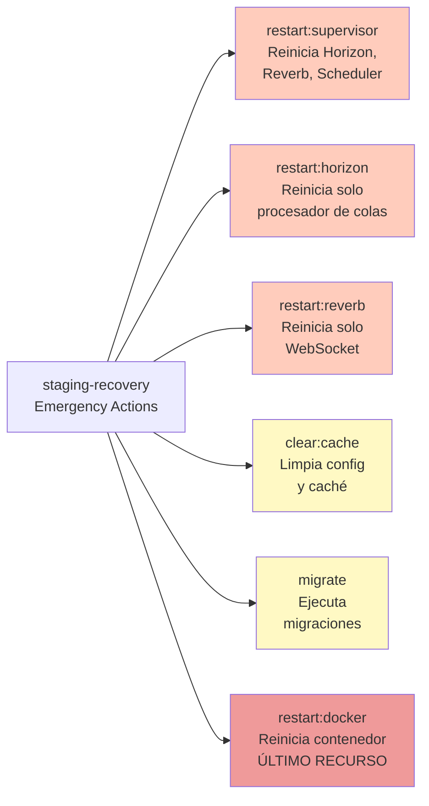

---

## Seguridad

### Arquitectura de Seguridad por Capas

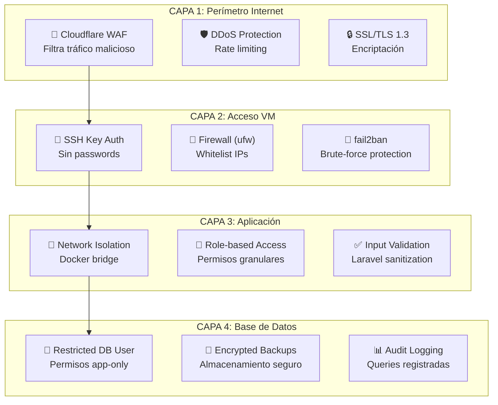

### Manejo de Secretos

| Secreto | Ubicación | Rotación | Acceso |
|---|---|---|---|
| DB Passwords | Bóveda corporativa | Semestral | Solo TI |
| API Keys | Bóveda corporativa | Anual | Solo app |
| SSH Keys | ~/.ssh/ (640) | Según política | Usuario |
| CF Tokens | ~/.cloudflared/ (600) | Anual | PM2 process |
| App Key | Variables sistema | Generado | Contenedor |

### Backups y Recuperación

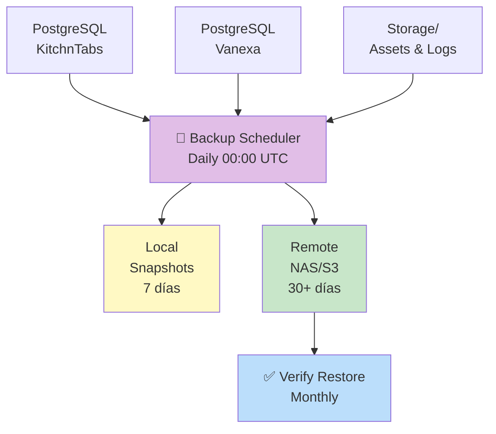

---

## Plan de Migración

### Fases de Implementación

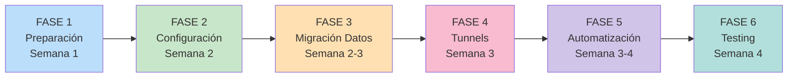

### Checklist de Implementación

#### Fase 1: Preparación
- [ ] Solicitud de VM aprobada por TI
- [ ] VM aprovisionada (8 vCPU, 32 GB, 500 GB SSD)
- [ ] Acceso SSH configurado (key-only)
- [ ] Volúmenes de almacenamiento montados
- [ ] Firewall configurado (443, 80, 22)

#### Fase 2: Configuración
- [ ] Docker Engine v24.x instalado
- [ ] Docker Compose v2.x instalado
- [ ] Node.js 18.x + pnpm instalados
- [ ] PM2 instalado globalmente
- [ ] Archivos `.env.*.staging` transferidos (SEGURO)

#### Fase 3: Migración de Datos
- [ ] Backup de BD producción obtenido
- [ ] PostgreSQL iniciado en ambos proyectos
- [ ] Datos restaurados en staging
- [ ] Verificación de integridad BD
- [ ] Redis inicializado

#### Fase 4: Tuneles y Networking
- [ ] Cloudflare tunnel creado (`kitchntabs-staging-server`)
- [ ] Token almacenado en `~/.cloudflared/`
- [ ] DNS configurado (4 dominios)
- [ ] Test: `curl https://api-staging.kitchntabs.com` ✓
- [ ] Test: WebSocket connectivity ✓

#### Fase 5: Automatización
- [ ] PM2 startup script configurado
- [ ] Auto-login habilitado (si macOS)
- [ ] Docker restart policies verificadas
- [ ] PM2 processes salvados
- [ ] Test de reboot completo

#### Fase 6: Testing
- [ ] Pruebas funcionales completas
- [ ] Pruebas de carga básicas (1000 req/s)
- [ ] Logs accesibles vía `pm2 monit`
- [ ] Alertas configuradas
- [ ] Documentación actualizada

---

## Diagrama de Flujo de Recuperación

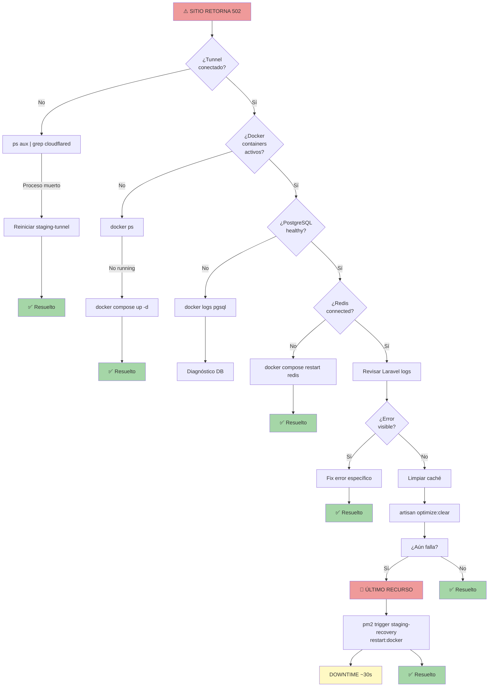

---

## Requisitos de Red y Conectividad

### Ancho de Banda Estimado

| Tráfico | Estimado | Tipo | Prioridad |
|---|---|---|---|
| Entrada HTTP/HTTPS | 1-5 Mbps promedio | Variable | Alta |
| Salida (API, webhooks) | 0.5-2 Mbps | Variable | Alta |
| Sincronización código (Git) | 100 Mbps ráfagas | Ocasional | Media |
| Dependencias (npm/composer) | 50 Mbps ráfagas | En deploys | Media |
| **Recomendación** | **100 Mbps dedicados** | Mínimo | - |

### Latencia Aceptable

```
Hacia Cloudflare:    < 50 ms
Intra-contenedores:  < 1 ms
PostgreSQL:          < 10 ms
Redis:               < 1 ms
DNS resolution:      < 50 ms
```

---

## Software Requerido

### Sistema Operativo

- **Recomendado:** Ubuntu 22.04 LTS (servidor)
- **Alternativa:** macOS 12+ (desarrollo permanente)

### Paquetes Obligatorios

```bash
# Ubuntu 22.04 LTS
docker.io                 # Docker Engine v24+
docker-compose            # v2.x
git                       # Control de versiones
curl, wget                # HTTP clients
nodejs                    # 18.x LTS (para PM2)
npm, pnpm                 # Package managers
openssh-server            # Acceso remoto
ufw                       # Firewall
fail2ban                  # Brute-force protection
htop                      # Monitoreo
rsync                     # Backups
```

### Imágenes Docker Requeridas

| Imagen | Versión | Uso |
|---|---|---|
| `local/dash-backend-core` | latest | App container (PHP 8.2) |
| `postgres` | latest (15+) | Base de datos |
| `redis` | alpine | Caché y colas |
| `mailhog/mailhog` | latest | Email testing |
| `nginx` | alpine | Documentación API |

---

## Configuración de Aplicación

### Variables de Entorno Requeridas

**Archivo: `.env.kitchntabs.staging`**
```env
# Database
DB_HOST=pgsql
DB_PORT=5432
DB_DATABASE=kitchntabs
DB_USERNAME=sail
DB_PASSWORD=[CONTRASEÑA_SEGURA_32_CARACTERES]

# Application
APP_ENV=staging
APP_KEY=[LARAVEL_GENERATED_KEY]
APP_URL=https://api-staging.kitchntabs.com

# WebSocket (Reverb)
REVERB_HOST=ws-staging.kitchntabs.com
REVERB_PORT=443
REVERB_SCHEME=https

# Redis
REDIS_HOST=redis
REDIS_PORT=6379
```

**Archivo: `.env.vanexa.staging`**
```env
# Idéntico a kitchntabs pero con:
DB_DATABASE=vanexa
APP_URL=https://api-staging.vanexa.cl
REVERB_HOST=ws-staging.vanexa.cl
```

---

## Métricas y Monitoreo

### KPIs del Sistema

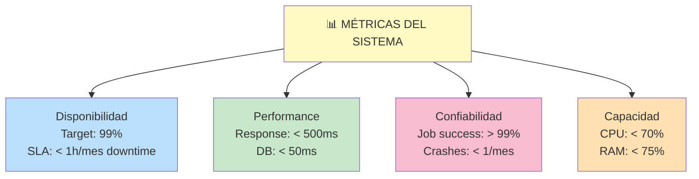

### Alertas Recomendadas

| Métrica | Umbral | Severidad |
|---|---|---|
| CPU utilization | > 80% por 5 min | ALTO |
| Memoria disponible | < 10% libre | ALTO |
| Espacio disco | < 10% libre | CRÍTICO |
| Endpoint 502/503 | > 5 en 5 min | CRÍTICO |
| Response time p95 | > 2s | ALTO |
| Job failed rate | > 5 por hora | ALTO |
| Tunnel desconectado | > 2 min | CRÍTICO |
| DB Connection pool | > 80% usado | MEDIO |

---

## Roadmap Futuro

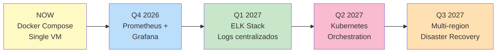

---

# 📝 FORMULARIO DE SOLICITUD - DEPARTAMENTO TI

**Para ser completado y enviado a:** `[email_TI@departamento]`

---

## PARTE I: INFORMACIÓN DE LA SOLICITUD

### Datos del Solicitante

```
Nombre Completo:        _________________________________
Departamento:           _________________________________
Correo Electrónico:     kitchntabs@gmail.com
Teléfono:              _________________________________
Fecha de Solicitud:     _________________________________
```

### Información del Proyecto

```
Nombre del Proyecto:    Preproducción KitchnTabs & Vanexa

Descripción Breve:      Despliegue de ecosistema dockerizado en 
                        ambiente de staging/preproducción para 
                        validación pre-release

Duración Requerida:     Permanente (24/7 crítico)

Prioridad:             [  ] Alta  [  ] Media  [  ] Baja
```

---

## PARTE II: ESPECIFICACIONES TÉCNICAS

### Máquina Virtual Requerida

```
☑ Tipo:                 Máquina Virtual dedicada
☑ Hypervisor:           [  ] VMware  [  ] KVM  [  ] Hyper-V
☑ Sistema Operativo:    [  ] Ubuntu 22.04 LTS  [  ] CentOS  [  ] macOS 12+
☑ CPU:                  8 vCPU mínimo
☑ RAM:                  32 GB mínimo
☑ Almacenamiento:       500 GB SSD NVMe (RAID 1 recomendado)
☑ Red:                  Gigabit (1 Gbps) dedicado
☑ IP Pública:           Sí (requerida para Cloudflare Tunnel)
```

### Software a Instalar

**Obligatorio:**
- [ ] Docker Engine v24.x
- [ ] Docker Compose v2.x
- [ ] Git
- [ ] curl, wget, net-tools, htop
- [ ] openssh-server
- [ ] ufw (firewall)
- [ ] fail2ban (seguridad)
- [ ] Node.js 18.x LTS
- [ ] pnpm 8.x

---

## PARTE III: CONFIGURACIÓN DE RED

### Puertos a Abrir en Firewall

**ENTRADA:**
```
☑ Puerto 443 (HTTPS)        Desde 0.0.0.0/0         [Permanente]
☑ Puerto 80 (HTTP)          Desde 0.0.0.0/0         [Permanente]
☑ Puerto 22 (SSH)           Desde [IPs autorizadas] [Permanente]
```

**SALIDA:**
```
☑ Todos los puertos         Hacia 0.0.0.0/0         [Permanente]
  (Requerido para Docker pull, npm, composer, Cloudflare)
```

### DNS y Resolución

```
Dominios a Configurar (Cloudflare DNS):
  ☑ api-staging.kitchntabs.com
  ☑ ws-staging.kitchntabs.com
  ☑ api-staging.vanexa.cl
  ☑ ws-staging.vanexa.cl
```

---

## PARTE IV: ALMACENAMIENTO Y BACKUP

### Volúmenes Requeridos

```
Punto de Montaje Principal:  /opt/applications/dash-backend-docker/
Tipo:                        SSD NVMe
Tamaño Total:               500 GB
RAID:                       RAID 1 (espejo recomendado)
```

### Política de Backups

```
☑ Backup Automático:       Sí - Diariamente
☑ Horario Backup:          00:00 UTC
☑ Destino:                 [NAS / S3 / Sistema backup corporativo]
☑ Retención Backups:       30 días diarios + 90 días semanales
☑ RTO (Recovery Time):     < 1 hora
☑ RPO (Recovery Point):    < 1 día
```

**Datos a Respaldar:**
- PostgreSQL (KitchnTabs + Vanexa)
- Volúmenes de almacenamiento (`./storage/`)
- Configuración de aplicación

---

## PARTE V: SEGURIDAD

### Requisitos de Acceso

```
SSH:
  ☑ Autenticación:    Clave privada SSH (RSA 4096 o Ed25519)
  ☑ Usuarios:         [Especificar usernames]
  ☑ Sudoers:          Acceso sudo requerido
  ☑ Restricción IP:   Solo desde IPs autorizadas

Credenciales:
  ☑ Almacenamiento:   Gestor de secretos corporativo
  ☑ DB Passwords:     Mínimo 32 caracteres
  ☑ Rotación:         Semestral
```

### Monitoreo de Seguridad

```
☑ fail2ban:                Habilitado (protección SSH)
☑ Firewall (ufw):          Habilitado con whitelist
☑ Audit Logging:           Habilitado en PostgreSQL
☑ Alertas:                 Configadas para fallos de autenticación
```

---

## PARTE VI: MONITOREO Y ALERTAS

### Métricas Críticas

```
☑ CPU utilización         Alerta si > 80%
☑ Memoria utilización     Alerta si > 85%
☑ Espacio disco           Alerta si < 10% libre
☑ Disponibilidad HTTP     Health check cada 60s
☑ Response time           Alerta si > 2s
☑ Errores aplicativos     Alerta si rate > 1/min
```

### Canales de Notificación

```
☐ Email:        kitchntabs@gmail.com
☐ Slack:        [Webhook URL]
☐ PagerDuty:    [Integración URL]
☐ Otro:         [Especificar]
```

---

## PARTE VII: APROBACIÓN

### Checklist Pre-Implementación

```
VALIDACIÓN:
  ☐ Especificaciones revisadas por TI
  ☐ Capacidad de infraestructura confirmada
  ☐ Política de backup validada
  ☐ Seguridad revisada
  
APROBACIÓN:
  ☐ Gerente TI:           _____________________ Fecha: ______
  ☐ Responsable Seguridad: _____________________ Fecha: ______
  ☐ Responsable Proyecto:  _____________________ Fecha: ______

CRONOGRAMA:
  Fase 1 - Preparación:      [Semana 1]
  Fase 2 - Configuración:    [Semana 2]
  Fase 3 - Migración Datos:  [Semana 2-3]
  Fase 4 - Tunnels:          [Semana 3]
  Fase 5 - Automatización:   [Semana 3-4]
  Fase 6 - Testing:          [Semana 4]
  
  Fecha Objetivo Go-Live:    _________________________________
```

---

## Contacto y Soporte

**Responsable Proyecto:**
- Email: kitchntabs@gmail.com
- Documentación: `PM2_AUTOMATION.md`, `README.md`
- Repositorio: `dash-backend-docker`

**Escalación Técnica:**
- Contacto TI: [A definir por departamento]
- Teléfono: [A definir]
- Horario: Lunes-Viernes 9:00-18:00 UTC

---

**Documento preparado:** Agosto 2026  
**Versión:** 1.0  
**Estado:** Listo para envío a departamento TI
