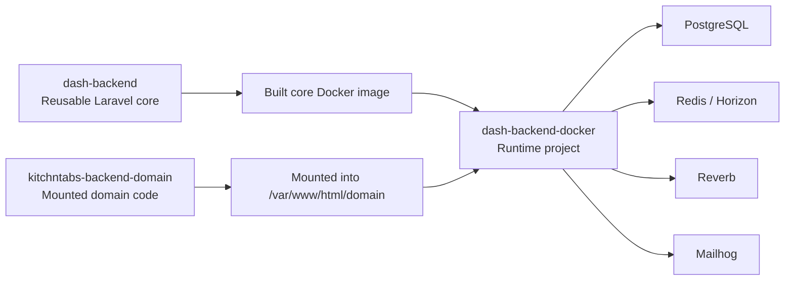

# Solution Architecture

## Purpose

This document explains how the Dash solution is structured across the core backend, the mounted domain layer, and the Docker runtime project. It defines the separation of concerns between the reusable core and domain-specific code, and it documents the end-to-end development process from environment setup to updating the `dash-backend-docker` runtime.

## High-Level Architecture



There are three major layers:

- `dash-backend`: the reusable Laravel core.
- `kitchntabs-backend-domain` (or another sibling domain repository): the mounted domain implementation.
- `dash-backend-docker`: the runtime composition project that runs a built core image and mounts the selected domain folder.

## Workspace Responsibilities

## 1. Core Layer: `dash-backend`

The core contains all platform-level logic that should be reused across multiple domains.

For permissions, the core owns the system catalog and seeder machinery. Domain-owned permissions live in the mounted domain repository, including the domain catalog plus one role default file per role, and are seeded by domain-layer seeders that the core `DatabaseSeeder` auto-discovers.

Core ownership includes:

- authentication and identity
- roles and permissions
- tenancy and tenant lifecycle
- subscription plans and plan limits
- payment gateways, billing state, and webhooks
- emails, in-app notifications, push notifications, queues, and realtime infrastructure hooks
- shared master data such as currencies and languages
- reusable API endpoints and policies
- shared migrations and seeders

The core must remain domain-agnostic. It can expose extension points to the domain, but it should not require one specific domain's business entities in order to work.

## 2. Domain Layer: `kitchntabs-backend-domain`

The domain contains client- or vertical-specific logic.

Domain ownership includes:

- client-specific routes
- client-specific models and services
- domain-only migrations
- domain-specific resources and requests
- custom workflows that extend the platform

The domain is mounted into the running container at `/var/www/html/domain` and loaded by the core when present.

In this workspace:

- `kitchntabs-backend-domain` is the current domain — it contains the ecommerce features such as products and categories.
- Domain-owned permissions live here in `database/data/permissions.json` and the per-role defaults live under `database/data/rolePermissions/`.
- They are seeded by `Domain\\Database\\Seeders\\Extended\\PermissionSeeder` and `Domain\\Database\\Seeders\\Extended\\RoleSeeder`.

Important architectural rule:

- Products, categories, and other ecommerce-specific concepts do not belong in the generic core unless they are elevated into a truly reusable multi-domain capability.

## 3. Runtime Layer: `dash-backend-docker`

The Docker runtime project does not contain the Laravel source of the core. Instead, it runs a prebuilt image and mounts configuration plus the selected domain.

Runtime responsibilities include:

- selecting the core image tag
- mounting the app env file
- mounting the domain folder
- bringing up PostgreSQL, Redis, Mailhog, and other services
- running tests against the built image plus mounted domain

This design is intentional:

- the core is released as an immutable image
- the domain remains editable and mountable
- deployment behavior stays close to production

## Separation of Concerns

The system works only if the boundary between core and domain remains strict.

## What Belongs In The Core

- data and workflows shared by every domain
- platform-wide authorization rules
- tenancy and subscription lifecycle
- payment and billing authority
- shared reference entities and infrastructure
- generic APIs and policies

Examples:

- currencies
- tenancies
- tenants
- users, roles, permissions
- subscription plans and entitlements
- payment gateways and payment webhooks
- database notifications and email notification flows
- broadcast channel authorization and websocket messaging
- FCM token registration and push delivery endpoints

## What Belongs In The Domain

- business entities used by one client or one vertical
- domain-specific route trees
- custom reports, workflows, and process logic
- views/resources that shape domain-specific responses
- migrations for domain-only tables

Examples:

- ecommerce product catalogs
- category hierarchies
- customer-specific integrations
- vertical-specific automation

## Boundary Rules

Use these rules when deciding where code should live:

1. If a feature must work for every domain, it belongs in the core.
2. If a feature is specific to one domain, it belongs in that domain.
3. The core may expose extension points to the domain, but the core must not depend on a single domain being mounted.
4. Domain models can extend or decorate core entities, but they should not redefine platform ownership.
5. Optional domain integrations in the core must be guarded so one domain does not break another.

## How The Core Integrates With A Domain

The core loads domain artifacts only when they exist.

Common integration points are:

- `domain/routes/api.php`
- domain models under `Domain\App\Models`
- domain resources, filters, requests, and controllers
- domain migrations under the mounted domain repository

This means the core can remain reusable while still allowing domain-specific behavior.

Examples from the current codebase:

- tenancy-scoped tenant CRUD in the core uses an extended domain tenant model/resource when available
- plan-limit logic uses guarded checks for optional domain-owned model counts
- route loading in `routes/api.php` includes domain routes only if the file exists
- notification APIs, broadcast auth, and websocket channel delivery are registered in the core so each domain inherits the same messaging platform

## Messaging Architecture

Messaging is a cross-cutting platform capability and belongs in the core.

The current architecture has several layers:

- notification APIs in `routes/api.php`
- system push endpoints in `routes/system.php`
- self-service notification endpoints in `routes/selfservice.php`
- broadcast authorization in `routes/channels.php`
- queue-backed delivery through Laravel notifications and mailables
- websocket transport through Reverb-compatible auth and channel routes

Core controllers already separate responsibilities:

- `App\Http\Controllers\API\Messaging\NotificationController` manages persisted user notifications and public/private notification sends
- `App\Http\Controllers\API\Messaging\WebSocketTestController` exercises public, private, and tenant-channel broadcast flows
- `App\Http\Controllers\API\Messaging\WebSocketTenantController` handles tenant chat-channel messaging

This is the intended boundary:

- the core owns transport, storage, channel authorization, and delivery plumbing
- the domain owns only the domain-specific meaning and payload content of messages

That separation allows a new domain to add notification types without reinventing broadcast auth, websocket routing, push token storage, or queue worker topology.

## Extending The System Without Modifying Core Logic

The preferred extension strategy is composition and decoration, not core forking.

Recommended pattern:

1. Reuse a core model, service, or controller when the capability already exists.
2. Add domain wrappers or extended resources when the domain needs a richer representation.
3. Add domain routes in `domain/routes/api.php` instead of editing unrelated core route files.
4. Add domain migrations in the domain repository for domain-owned tables.
5. Keep core tests focused on core-owned guarantees only.

Good examples:

- extend tenant serialization in the domain while leaving tenancy, currency, and subscription ownership in the core
- react to billing state in the domain while keeping gateway integration in the core
- create a domain-only model that references a core tenant or tenancy rather than duplicating the tenant concept

Bad examples:

- moving currencies into the domain
- making the core require a product model that only one domain uses
- duplicating subscription, billing, or payment authority in the domain

## Development Process

## 1. Prepare The Environment

The authoritative setup references are:

- `dash-backend/ENVIRONMENT-SETUP.md`
- `dash-backend/LOCAL.md`
- `dash-backend-docker/README.md`

At a high level:

1. Use Linux or WSL2 on Windows.
2. Install Docker and Docker Compose.
3. Install Composer dependencies for `dash-backend`.
4. Prepare the Laravel env file.
5. Start the runtime stack.
6. Run migrations and seeders.

Typical commands in `dash-backend`:

```bash
docker run --rm --security-opt seccomp=unconfined -u "$(id -u):$(id -g)" -e COMPOSER_HOME=/tmp/composer -e COMPOSER_CACHE_DIR=/tmp/composer/cache -v "$(pwd):/var/www/html" -w /var/www/html laravelsail/php83-composer:latest composer install --ignore-platform-reqs --prefer-dist --no-cache --no-progress

cp .env.example .env.local
```

Typical first run commands:

```bash
sail up -d
sail artisan key:generate
sail artisan migrate:fresh --seed
sail artisan db:sync_roles
```

## 2. Start The Local Runtime

Development normally uses multiple terminals:

```bash
sail up
sail artisan horizon
sail artisan reverb:start --debug
```

Or in the runtime project:

```bash
docker compose up -d
docker compose exec app php artisan horizon
docker compose exec app php artisan reverb:start --debug
```

## 3. Work In The Correct Layer

Before implementing a change, decide whether it belongs in the core or the domain.

Use the following workflow:

1. If the feature is platform-level, edit `dash-backend`.
2. If it is client-specific, edit the domain repository.
3. If the domain needs extra behavior on top of a core entity, extend it in the domain instead of copying the entity.
4. Avoid introducing new core dependencies on domain-only models.

## 4. Validate With The Correct Test Suite

The project distinguishes between core and domain validation.

Core suite:

```bash
docker compose exec app php artisan test --testsuite Core
```

JUnit output:

```bash
docker compose exec app php artisan test --testsuite=Core --log-junit /var/www/html/reports/core_results.xml --no-ansi
```

The Core suite is the primary guardrail for ensuring the reusable platform still works independently of any specific business domain.

For messaging-related changes, validation should also include operational checks:

- confirm notification endpoints still serialize correctly
- confirm Horizon is running for queued notifications
- confirm Reverb is running for websocket delivery
- confirm Mailhog or the configured mail transport is available for email flows

## 5. Update The Core Docker Image

When core code changes, update the Docker image consumed by `dash-backend-docker`.

For a local rebuild from `dash-backend`:

```bash
docker build -f docker/php8.3/Dockerfile.core -t local/dash-backend-core:latest .
```

For release flow, `dash-backend-docker/README.md` documents the CI-oriented publish path using `docker-publish-core.sh`.

## 6. Run The Updated Runtime Project

In `dash-backend-docker`:

1. Ensure the image tag in `.env` points to the new core image.
2. Ensure the selected domain path is mounted through `DOMAIN_PATH`.
3. Restart the stack.

Common commands:

```bash
docker compose down -v
docker compose up -d
docker compose exec app php artisan migrate:fresh --seed
```

## 7. Verify The Integrated Result

After rebuilding and remounting:

- run the Core suite
- inspect `reports/core_results.xml`
- confirm that only core-owned guarantees are being tested in the Core suite
- move any domain-owned test expectations out of core when necessary

## Architecture Decisions That Matter In Practice

## Core Image, Mounted Domain

The most important architectural decision is that the runtime consumes a built core image while mounting the domain folder separately.

Benefits:

- core releases are reproducible
- domain development remains flexible
- the runtime resembles production deployment
- boundaries are easier to police

This also matters for messaging:

- websocket, queue, push, and mail infrastructure stay part of the core runtime contract
- domains can extend payloads and listeners without redefining how notifications are transported

## Shared Migrations Versus Domain Migrations

The core already contains most platform migrations. Domain repositories add only the migrations required for domain-owned tables.

Implication:

- do not create duplicate core migrations in the domain
- do not move core-owned tables such as currencies or tenancies into domain migrations

## Optional Domain Surface

The core must tolerate multiple domains with different capabilities.

That is why optional integrations should be handled through:

- guarded class lookups
- guarded relationship calls
- domain-specific resources/controllers that decorate, rather than replace, the core

## Recommended Refactoring Direction

Based on the current workspace history:

- keep `kitchntabs-backend-domain` focused on its ecommerce domain (products, categories, logistics)
- keep the core focused on universal platform services
- keep ecommerce-heavy product/category logic in the domain, not the core, where that business model actually belongs

This reduces accidental coupling and keeps the Core suite honest.

## Summary

The solution is intentionally split into a reusable core, a mounted domain, and a runtime Docker project. The core provides platform services. The domain provides client-specific business behavior. The Docker runtime composes both into a working application. If that separation is preserved, new domains can be added and existing ones can evolve without forcing domain-specific assumptions back into the shared platform.
